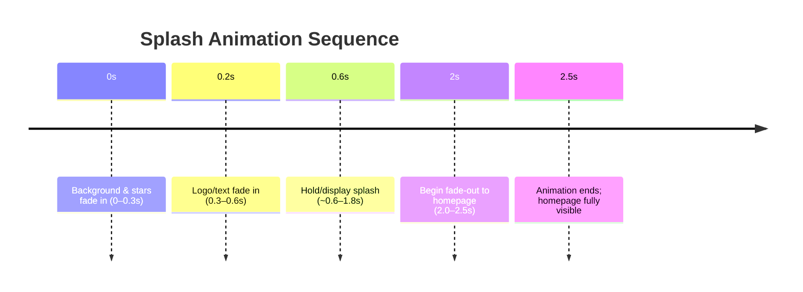

# Executive Summary  
A 3-4 second **space-themed splash screen** can set a futuristic, polished first impression without delaying the main site. Key best practices include using minimal, GPU-accelerated animations (e.g. CSS transforms/opacity) to keep performance high【37†L408-L415】. Preload only the essential assets for the animation (using `<link rel="preload">`) so it appears instantly, while loading homepage assets in the background【43†L165-L173】. Use a dark cosmic palette (navy/black base with neon blue/purple/cyan highlights) and concise text (name/tagline) on the splash. Structure animations with clear phases (fade-in, pause, fade-out) totalling ~2.5s (well under the 5s guideline for auto-closing animations【40†L130-L139】). Respect accessibility (honor `prefers-reduced-motion`, allow “skip”/cancel) so users can bypass or reduce motion【38†L25-L34】【40†L83-L92】. Animation timings should feel snappy yet smooth; for example, use ease-out transitions of ~200–500ms for fades【51†L158-L163】. 

The table below compares common **visual motifs** for a space splash (and Figure images illustrate examples). Each option varies in complexity, asset size, and impact:

| **Visual**      | **Complexity**           | **Asset Size**        | **Impact**                  | **Recommended Use**                                      |
|-----------------|--------------------------|-----------------------|-----------------------------|---------------------------------------------------------|
| **Astronaut**   | High (3D model/photo)    | Large (high-res)      | Very high (human element)   | Adds personality/brand feel; use if content or person-oriented.  |
| **Planet**      | Medium (2D/3D render)    | Medium                | High (iconic sci-fi vibe)   | Broad tech/science theme; a rotating globe suggests scope.       |
| **Glowing Orb** | Low (simple sphere)      | Small                 | Moderate (abstract/futuristic) | Modern/minimalist feel; subtle effect.                      |
| **Shooting Star** | Low (vector/particle) | Very small            | Accent/transition cue       | Use sparingly (e.g. one-shot streak) as a dynamic accent.      |

【19†embed_image】 *Figure: An **astronaut** motif yields a strong human/sci-fi connection but requires more complex assets (e.g. 3D model or photo) and careful motion handling【37†L408-L415】【40†L83-L92】.*  

【25†embed_image】 *Figure: A **planet** graphic (like Earth/Neptune) is medium-impact and moderate in size. It can be animated (slow rotate or orbit) purely with CSS transforms for smooth GPU-accelerated motion【37†L408-L415】.*  

【30†embed_image】 *Figure: A **glowing orb** (abstract sphere) has the smallest asset footprint. Its simple form makes lightweight animations easy, aligning well with `prefers-reduced-motion` compliance【37†L408-L415】【38†L25-L34】.*  

## Animation Sequence & Timing  
A clear timeline ensures the splash is brief and engaging (2–3 seconds total). For example:



- **Entry/Exit Effects**: Use short **ease-out** transitions (~200–500ms) for fades, so elements start quickly and slow into place【51†L158-L163】. For example, fade-in the background and logo with `transition: opacity 0.3s ease-out`.  
- **Hold Phase**: Keep the splash static for ~1–1.5s (subject to performance) before exit, ensuring the homepage has loaded beneath. This 2–3s total is safely under the “stop within 5s” guideline【40†L130-L139】.  
- **Delays & Easing**: Introduce slight delays (e.g. text appears 0.1–0.2s after background) to create a smooth reveal. Avoid overly complex easings (sticking to gentle ease-in/out is best)【51†L158-L163】.

## Performance & Technical Approach  
- **Non-Blocking**: Implement the splash as an **overlay** or separate layer that does not block core homepage rendering. Preload only its key image or animation data (e.g. hero SVG, logo) with `<link rel="preload">`【43†L165-L173】. Load remaining homepage scripts/styles asynchronously or lazily.  
- **Lightweight Animations**: Prefer **CSS animations/transitions** over heavy JavaScript loops【37†L248-L256】. Animate only transform and opacity properties so the browser can offload them to the GPU【37†L408-L415】, ensuring smooth 60fps motion.  
- **Assets**: Use SVG/Canvas/inline elements when possible (e.g. an SVG planet or CSS-rendered orb) to reduce image sizes. A large sprite or video is not recommended. Any image (e.g. PNG of astronaut) should be minimal resolution.  
- **Lazy Loading**: Begin fetching main homepage assets during the splash hold. For instance, inject `<script>` modules or use `fetch` in parallel, then fade away the splash to reveal the fully-loaded page.  

## Accessibility  
- **Reduced Motion**: Honor the user’s `prefers-reduced-motion` setting. If set, skip or simplify animations (e.g. jump straight to homepage)【38†L25-L34】【40†L83-L92】. For example, wrap key CSS animations in `@media (prefers-reduced-motion: no-preference) { ... }`.  
- **Skip/Close Option**: Provide a visible “Skip” or “Enter Site” button at all times (hidden behind the splash) so users can bypass the intro if desired【40†L83-L92】.  
- **No Flashes**: Avoid rapid flashing elements. If using star pulses, ensure no more than 3 flashes per second (WCAG 2.3.1)【40†L108-L117】.  
- **Duration Compliance**: By ending animations by ~2.5s, we comply with WCAG “5 second” rule for auto-advancing content【40†L130-L139】.  

## Integration to Homepage  
Transition seamlessly from splash to home: use a **crossfade or slide** that coincides with the final fade-out. For example, fade the splash’s opacity to 0 while the homepage content (already loaded underneath) appears. Ensure the handoff is instant once the animation ends.  

## Final Prompt  
```plaintext
Create a 2–3 second space-themed splash screen for a personal portfolio. Use a full-screen dark cosmic background (navy/black gradient with subtle starfield or nebula effects). Feature a central space element (choose one: an astronaut, a planet, or a glowing orb) that smoothly animates (e.g. gentle floating or rotation) during the intro. Overlay minimal text: a bold name (placeholder [Your Name]) and a short tagline (placeholder [Your Tagline]). Animate text with a quick fade or typing effect (about 200–300ms ease-out). Keep animations light and smooth: fade in the background and element (0.2–0.5s), hold ~1.0–1.5s, then fade out (0.5s) to reveal the homepage content already loading underneath. Use CSS transforms and opacity only. The color palette should be deep black/navy with neon blue/purple/cyan accents. Provide high contrast text, modern fonts (e.g. Poppins, Inter). Include a small skip button for accessibility. Ensure the animation is non-blocking: preload just the splash assets, load the homepage in parallel, and upon splash end smoothly hand off to the main page.  Deliver as a clean, production-ready code snippet (React or HTML/CSS/JS) that implements this splash animation and transitions to the homepage.
```